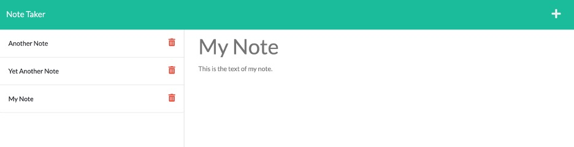
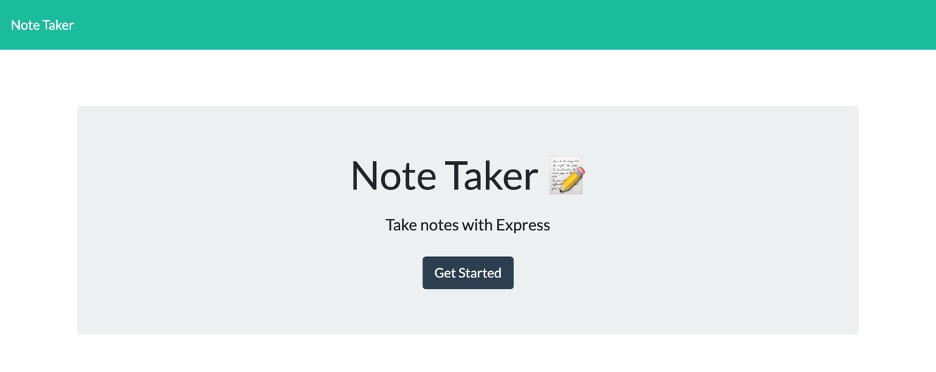
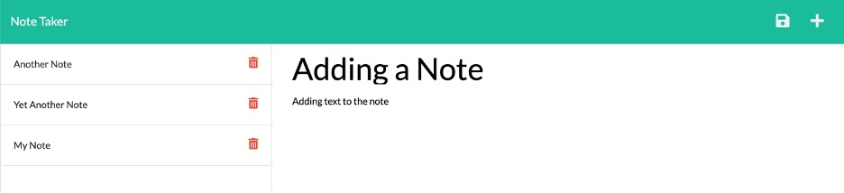

# Note Taker 

## Technology Used 

| Technology Used         | Resource URL           | 
| ------------- |:-------------:| 
| JavaScript    | [https://developer.mozilla.org/en-US/docs/Web/JavaScript](https://developer.mozilla.org/en-US/docs/Web/JavaScript) | 
| Node.JS     | [https://nodejs.org/en/](https://nodejs.org/en/)      |   
| Express.JS | [https://expressjs.com/](https://expressjs.com/)     |    

## Description 

[Visit the Deployed Site](https://sheltered-anchorage-72122.herokuapp.com/)

This app allows a user to save notes in an online repository so they can be retrieved, viewed, and deleted from anywhere.

<br/>



<br/>

## Table of Contents

* [Code Refactor Example](#code-refactor-example)
* [Usage](#usage)
* [Learning Points](#learning-points)
* [Author Info](#author-info)
* [Credits](#credits)
* [License](#license)

<br/>

## Code Refactor Example

For this project, the front end was provided as starter code and did not require refactoring. The back end had to be created from scratch. However, code within the front end created certain requirements for code within the back end. For example, the front end included both an index.html and a notes.html page. As shown below, the Get Started button on the index page linked to the notes page.

```html
<a class="btn btn-primary btn-lg mt-4" href="/notes" role="button">Get Started</a>
```

Similarly, the Note Taker link in the navbar on the notes page linked to the index page.

```html
<a class="navbar-brand" href="/">Note Taker </a>
```

These links indicated the back end code needed to be able to route the user between the pages and serve up the relevant html pages, which the code below accomplishes:

```JavaScript
app.get('/', (req, res) =>
  res.sendFile(path.join(__dirname, '/public/index.html'))
);

app.get("/notes", (req, res) => 
  res.sendFile(path.join(__dirname, "/public/notes.html"))  
);

app.get("/*", (req, res) =>
  res.sendFile(path.join(__dirname, "/public/index.html"))
);
```

In addition, the API calls in the client-side JavaScript specified the format of the API endpoints that would be needed in the back-end code, as in the example below:

```JavaScript
const getNotes = () =>
  fetch('/api/notes', {
    method: 'GET',
    headers: {
      'Content-Type': 'application/json',
    },
  });
```

The server-side route below matches the route provided above:

```JavaScript
// GET route
notes.get("/", (req, res) => {
    fs.readFile(path.join(__dirname, "../db/db.json"), "utf-8", (err, data) => {
        if (err) {
            console.error(err);
            res.status(502).json("Error reading notes.");
        } else {
            res.status(200).json(JSON.parse(data));
        }
    });
});
```

<br/>

## Usage 

1. To begin, click the **Get Started** button on the landing page, as shown below.

<br/>



<br/>

2. On the Notes page (see below), existing notes are shown on the left-hand side. Click one of these notes to view the note text. When this page loads, a form offers the ability to enter a new note by entering a title and text for the note, then clicking the disk icon.

<br/>



<br/>

You may click the delete icon (trash can) to delete an existing note.

<br/>

## Learning Points 

I learned several valuable skills in the course of completing this project:
* How to start up an **Express** server
* How to implement **Express routing**
* How to implement modularity in Express routing to achieve separation of concerns
* How to create **promises** in JavaScript
* How to publish a full-stack application with **Heroku**

<br/>

## Author Info

### Ryan Moscoe 

* [Portfolio](https://rmoscoe.github.io/portfolio/)
* [LinkedIn](https://www.linkedin.com/in/ryan-moscoe-8652973/)
* [Github](https://github.com/rmoscoe)

<br/>

## Credits

Starter code provided by Trilogy Education Services, LLC, a 2U, Inc. brand, in conjunction with the University of California, Berkeley.

<br/>

## License

See repository for license information.